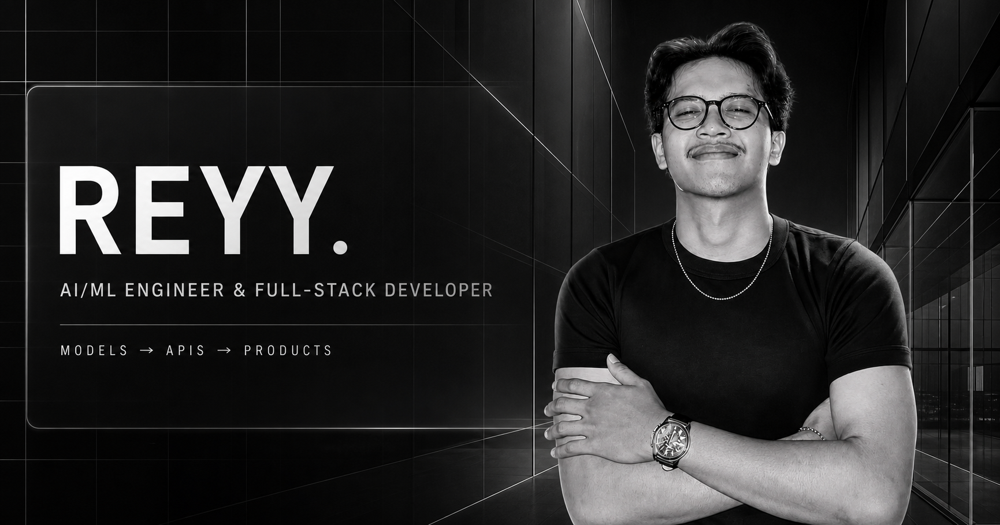
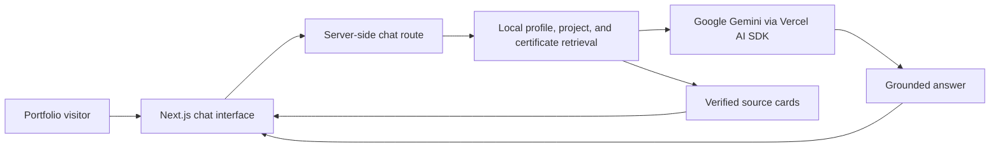

# Reyy Portfolio

Recruiter-focused portfolio for **Mohammad Raihan Hadriansyah Prasetya (Reyy)**, an AI/ML Engineer and Full-Stack Developer who connects machine-learning work to APIs, data systems, interfaces, and deployment workflows.

[View the live portfolio](https://portoreyy.vercel.app) | [English](https://portoreyy.vercel.app/en) | [Bahasa Indonesia](https://portoreyy.vercel.app/id)



## About the portfolio

This website is designed to answer the questions a recruiter or engineering lead usually asks first:

- What role is Reyy targeting?
- What is his strongest project?
- What did he personally contribute?
- Which claims are supported by source code, recorded results, or a live product?
- What are the limitations and next engineering steps?

Reyy has completed his Telecommunication Engineering thesis defense and is awaiting formal yudisium before graduation. The public wording deliberately avoids claiming formal graduate status before that process is complete.

## What is included

- English and Indonesian routes with localized navigation and metadata.
- Dark theme by default and a complete light theme.
- Seven project case studies with role context, architecture, decisions, evidence, limitations, repositories, and visual previews.
- SCOVIS as the flagship applied AI and full-stack case study.
- **Five interactive project visualizers**: Architecture Visualizer (SCOVIS), ML Playground (DermaScan), Vehicle Model Inspector (Vehicle Classification), QuizInt Mobile Emulator (QuizInt), and Flask/MongoDB CRUD API Inspector (Cloud Inventory API).
- A **Quick Recruiter Contact Form** in the contact section with Supabase lead persistence and instant Resend email notification.
- **1-Click Recruiter Summary** button on the About page that copies a formatted candidate profile to clipboard.
- **Contextual AI Action Chips** below assistant responses for one-click navigation to projects, CV modal, and contact.
- **Adaptive 3D Lanyard** with CSS 3D flip-card mobile fallback and on-demand physics toggle.
- A privacy-reviewed gallery of 44 unique certificates and professional learning records.
- Eleven direct issuer verification links where official public verification is available.
- A grounded Gemini AI Guide with recruiter, technical, and exploration modes.
- Source cards that let visitors open the relevant case study, repository, live product, certificate verification, or profile.
- Responsive layouts, keyboard-visible interactions, SEO metadata, sitemap, robots policy, favicon, and social preview.
- Curated React Bits interactions adapted to the monochrome visual system.
- Playwright E2E test suite covering all 7 project routes, localization, credentials gallery, and About page.

## Featured work

| Project | Focus | Evidence links |
|---|---|---|
| SCOVIS | Human-in-the-loop answer-image score classification with Next.js, Supabase, FastAPI, Redis/RQ, and TensorFlow | [Frontend](https://github.com/RaihanHadriansyah21/scovis-frontend), [Backend](https://github.com/RaihanHadriansyah21/scovis-backend), [Live](https://scovis.vercel.app) |
| DermaScan | Educational skin-lesion decision-support prototype with TFLite, FastAPI, React, Railway, and Vercel | [Repository](https://github.com/RaihanHadriansyah21/DermaScan_Project), [Live](https://dermascan-azure.vercel.app) |
| Vehicle Classification | Four-class MobileNetV2 transfer-learning experiment with SavedModel, TFLite, and TensorFlow.js exports | [Repository](https://github.com/RaihanHadriansyah21/vehicle-image-classification-mobileNetV2) |
| QuizInt | Flutter and Supabase learning prototype with role-based quizzes, QR onboarding, biometrics, and analytics | [Repository](https://github.com/RaihanHadriansyah21/quizint-learning) |
| Bitcoin Forecasting | Experimental multi-step forecasting with LSTM, attention, and Seq2Seq workflows | [Repository](https://github.com/RaihanHadriansyah21/bitcoin-price-forecasting-seq2seq) |
| Gojek Sentiment Analysis | Indonesian review sentiment comparison using Logistic Regression, linear SVM, and a dense neural network | [Repository](https://github.com/RaihanHadriansyah21/gojek-sentiment-analysis-ml-dl) |
| Cloud Inventory API | Academic Flask and MongoDB CRUD API demonstrating backend and single-VM cloud foundations | [Repository](https://github.com/RaihanHadriansyah21/Project-1-Cloud-Computing) |

Team projects are labeled as team work. Recorded metrics retain their original evaluation context and are not presented as real-world guarantees.

## AI Guide architecture



The assistant is explicitly identified as an automated guide, not Reyy. It answers from structured portfolio data, preserves team-contribution boundaries, refuses undocumented claims, and keeps source links separate from the answer for easier reading. Chat history uses browser `sessionStorage`; no portfolio database is required.

The API also applies same-origin validation, request and message-size limits, a short per-instance rate limit, and server-only access to the Gemini key.

## Technology stack

- Next.js 16 App Router, React 19, and TypeScript.
- Tailwind CSS 4/PostCSS plus a custom responsive CSS design system.
- Vercel AI SDK with the Google Gemini provider.
- GSAP for navigation and interaction motion.
- React Three Fiber, Drei, Rapier, Three.js, and Meshline for the Lanyard identity experience.
- React Icons for accessible social links.
- React Bits components adapted to the project: GlassSurface, PillNav, ProfileCard, Lanyard, and LogoLoop.
- Supabase (PostgreSQL) for chat lead persistence and analytics telemetry.
- Resend API for automated recruiter contact email alerts.
- Playwright for E2E browser testing across all routes and locales.
- Vercel for deployment and environment management.

## Project structure

```text
app/
  [lang]/                 Localized pages and project routes
  api/chat/               Grounded AI Guide endpoint
components/               UI, React Bits adaptations, galleries, and chat
lib/
  portfolio.ts            Profile, project, link, and bilingual content
  certificates.ts         Public certificate metadata
  ai/                     Retrieval context and chat types
public/
  projects/previews/      Evidence-based project previews
  certificates/previews/  Privacy-reviewed certificate images
  images/                 Public portrait assets
```

Raw certificates and local environment files are intentionally excluded from Git.

## Local development

Requirements:

- Node.js 20 or newer.
- npm.
- A Google Generative AI API key only if the AI Guide needs to run locally.

Install and start the development server:

```bash
npm install
npm run dev
```

Open `http://localhost:3000`. The root route redirects to `/en`; the Indonesian version is available at `/id`.

For local AI Guide support, create `.env.local` without committing it:

```dotenv
GOOGLE_GENERATIVE_AI_API_KEY=your_key_here
GEMINI_MODEL=gemini-3.5-flash
NEXT_PUBLIC_SITE_URL=http://localhost:3000

# Optional: distributed chat rate limiting for Vercel/serverless deployments.
# Vercel's Upstash integration supplies KV_REST_API_URL and KV_REST_API_TOKEN automatically.
# The legacy UPSTASH_REDIS_REST_URL / UPSTASH_REDIS_REST_TOKEN names are also supported.
KV_REST_API_URL=your_upstash_rest_url
KV_REST_API_TOKEN=your_upstash_rest_token
CHAT_RATE_LIMIT_SALT=your_long_random_secret
```

`GEMINI_MODEL` and `NEXT_PUBLIC_SITE_URL` are optional. The two Redis values plus `CHAT_RATE_LIMIT_SALT` are optional as a group: when all are present, the chat API uses a distributed 12-request / 5-minute limiter; otherwise it uses a best-effort local fallback. The distributed identifier is an HMAC of the visitor IP, not the chat content, and Upstash analytics is disabled. Never expose any secret through a `NEXT_PUBLIC_` variable.

## Validation

```bash
npm run lint
npm run build
```

### E2E Tests (Playwright)

Run end-to-end tests against a local production build:

```bash
# Install Playwright browsers once
npx playwright install chromium

# Playwright starts the local production server from its configuration
npm run build
npm run test
```

Test coverage: all 7 project detail routes, homepage contact form, English/Indonesian localization, credentials gallery, and About page identity.

Before deployment, also review `git status` and the staged diff so raw certificates, environment files, local source assets, or unrelated changes are not committed.

## Content and privacy policy

Public copy distinguishes:

- verified implementation found in source or configuration;
- recorded results from a specific experiment;
- documented contribution in a team project;
- limitations and follow-up work;
- analysis or interpretation that should not be presented as fact.

The certificate gallery publishes reviewed previews, not raw PDFs. NIM/NIP values, unnecessary credential identifiers, private paths, student data, secrets, signed URLs, and sensitive configuration must never be published. Direct verification links are used only when an issuer provides an official public page.

## Deployment

The `main` branch is connected to Vercel and deployed at [portoreyy.vercel.app](https://portoreyy.vercel.app). The canonical site URL can be overridden with `NEXT_PUBLIC_SITE_URL` for another environment.

## Connect

- [GitHub](https://github.com/RaihanHadriansyah21)
- [LinkedIn](https://www.linkedin.com/in/reyhadri)
- [Instagram](https://www.instagram.com/reyhadri)
- [Live portfolio](https://portoreyy.vercel.app)

## Usage note

This is a personal portfolio repository. The source is public for technical review, but no separate open-source license is currently provided. Personal content, certificate previews, and visual assets should not be reused without permission.
