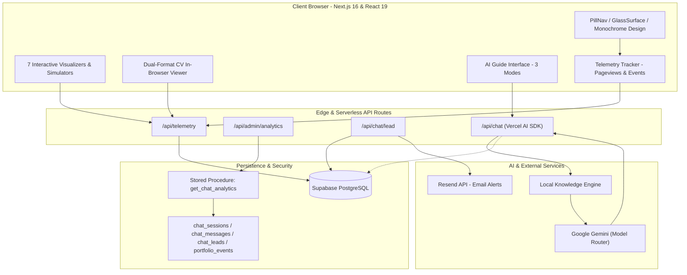

# Reyy Portfolio

> **Production-grade, recruiter-focused portfolio for Mohammad Raihan Hadriansyah Prasetya (Reyy)** — AI/ML Engineer and Full-Stack Developer bridging machine learning, robust APIs, interactive interfaces, and scalable deployments.

[](https://portoreyy.vercel.app)
[](https://nextjs.org)
[](https://react.dev)
[](https://ai.google.dev)
[](https://supabase.com)

[Explore Live Portfolio](https://portoreyy.vercel.app) · [English Version](https://portoreyy.vercel.app/en) · [Versi Bahasa Indonesia](https://portoreyy.vercel.app/id) · [LinkedIn](https://www.linkedin.com/in/reyhadri) · [GitHub](https://github.com/RaihanHadriansyah21)

---


## 📌 Executive Summary for Hiring Teams

This portfolio is engineered specifically to answer the core questions engineering leaders and technical recruiters evaluate:

| Recruiter Question | Candidate Evidence |
| :--- | :--- |
| **Target Roles** | **AI/ML Engineer**, **Full-Stack Developer**, and **Backend Engineer** |
| **Education & Status** | **Bachelor of Engineering (S.T.)** in Telecommunication Engineering, Telkom University<br>*(Yudisium Completed, GPA 3.29, Commencement in Nov 2026)* |
| **Availability** | **Immediate Full-Time Availability** · Open to On-site (Bandung/Jakarta), Hybrid, or Remote |
| **Flagship Project** | **SCOVIS** — Multi-tier handwritten answer score classification system connecting Next.js, Supabase, FastAPI, Redis/RQ, and TensorFlow |
| **Proof & Integrity** | **100% Evidence-Led**: All 7 projects feature direct GitHub repositories, live deployments, and custom interactive visualizers |
| **Verified Credentials** | **46 curated technical credentials** with verified learning hours, complete syllabi, and graded project submissions |

---

## 🌟 Key Product & Recruiter Features

### 1. 100% Full Interactive Visualizer Coverage (All 7 Projects)
Every project case study includes a fully functional, browser-based interactive inspector/visualizer to demonstrate architecture, logic, and output without requiring local environment setup:
- 🔬 **SCOVIS**: *Interactive Multi-Tier Architecture Visualizer* (node-graph inspects Next.js, Supabase, FastAPI, Redis/RQ, and TensorFlow worker flow).
- 🩺 **DermaScan**: *ML Skin-Lesion Confidence Playground* (real-time risk simulator, 5-class probability breakdown, and clinical disclaimers).
- 🚗 **Vehicle Classification**: *MobileNetV2 Inspector & Benchmark Matrix* (4-class confidence explorer with model-export comparisons across SavedModel, TFLite, and TF.js).
- 📱 **QuizInt**: *Mobile Flutter Interactive Simulator* (role-switching between Learner, Instructor, and Admin with live gamification mechanics).
- ☁️ **Cloud Inventory API**: *Flask/MongoDB API Pipeline Inspector* (interactive CRUD simulator and 3-step VM topology inspector).
- 💬 **Gojek Sentiment Analysis**: *Indonesian NLP Tokenizer & Classifier Sandbox* (real-time Sastrawi stemmer and multi-model benchmark across Logistic Regression, Linear SVM, and ANN).
- 📈 **Bitcoin Price Forecasting**: *Seq2Seq 72/24 Attention Scrubber* (sequence visualizer with multi-head attention weights inspector and technical indicator toggles).

### 2. Recruiter Experience Suite
- 🎖️ **Interactive Recruiter Availability Badge**: Hero modal showing immediate availability, target positions, location preferences, and one-click candidate summary.
- 📄 **In-Browser Dual-Format CV Modal**: Interactive PDF viewer with instant switching between *Software Engineer* and *AI/ML Engineer* CVs, with direct download buttons.
- 🧩 **Cross-Project Interactive Skill Matrix**: Live filter linking core technologies (FastAPI, TensorFlow, Next.js, Supabase, Python, Docker) directly to matched projects and credentials.
- 📋 **1-Click Recruiter Summary**: One-click clipboard copy of candidate markdown summary formatted for HR portals and team notes.
- 📬 **Quick Recruiter Contact Form**: Lead capture at `#contact` powered by Supabase persistence and instant transactional email notifications via Resend API.
- ⚡ **Command Menu (Ctrl+K)**: Instant keyboard-driven navigation across all sections, projects, and external links.
- 🎙️ **AI Voice Briefing Player**: In-browser audio briefing synthesizing candidate highlights.

### 3. Grounded AI Guide (Gemini + Local RAG)
- Built with **Vercel AI SDK** and **Google Gemini**, streaming real-time responses.
- Grounded strictly on verified portfolio knowledge (`lib/ai/portfolio-knowledge.ts`). Refuses hallucination, enforces contribution boundaries, and outputs interactive source cards.
- Supports 3 tailored modes: **Recruiter Mode**, **Technical Mode**, and **Explore Mode**.

### 4. Telemetry & Private Admin Analytics (`/admin`)
- Real-time privacy-compliant visitor analytics backed by Supabase PostgreSQL RPC:
  - Live visitor metrics (hashed-IP unique visitors, pageviews, peak hours in WIB).
  - CV & engagement telemetry (in-browser previews, PDF downloads, 1-click email copies, command palette triggers).
  - **Project Click Heatmap**: Real-time ranking of the most-clicked project cards.
  - Recruiter leads inbox and top inquired AI questions.

---

## 🏆 Project Portfolio & Evidence Map

| No | Project | Tier | Engineering Focus & Tech Stack | Evidence & Repositories |
| :---: | :--- | :---: | :--- | :--- |
| **01** | **SCOVIS** | **Flagship** | Human-in-the-loop handwritten-answer score classification platform.<br>`Next.js 15` · `TypeScript` · `FastAPI` · `TensorFlow` · `Supabase` · `Redis/RQ` · `Docker` | [Frontend Repo](https://github.com/RaihanHadriansyah21/scovis-frontend) · [Backend Repo](https://github.com/RaihanHadriansyah21/scovis-backend) · [Live App](https://scovis.vercel.app) |
| **02** | **DermaScan** | **Featured** | Educational skin-lesion decision-support prototype with multi-task inference.<br>`TFLite` · `FastAPI` · `Python` · `React 18` · `Vite` · `Railway` · `Vercel` | [Repository](https://github.com/RaihanHadriansyah21/DermaScan_Project) · [Live App](https://dermascan-azure.vercel.app) |
| **03** | **Vehicle Classification** | **Featured** | 4-class computer vision transfer-learning experiment using frozen MobileNetV2.<br>`TensorFlow` · `Keras` · `MobileNetV2` · `SavedModel` · `TFLite` · `TF.js` | [Repository](https://github.com/RaihanHadriansyah21/vehicle-image-classification-mobileNetV2) |
| **04** | **QuizInt** | **Featured** | Mobile gamified learning application with biometric auth, QR onboarding, and PDF export.<br>`Flutter` · `Dart` · `Provider` · `Supabase Auth/PostgreSQL` · `Local Auth` | [Repository](https://github.com/RaihanHadriansyah21/quizint-learning) |
| **05** | **Bitcoin Forecasting** | **ML Lab** | Experimental 24-step forecasting comparing baseline LSTM, Attention LSTM, and Seq2Seq.<br>`TensorFlow` · `Seq2Seq` · `Custom Attention` · `Time Series` · `pandas` | [Repository](https://github.com/RaihanHadriansyah21/bitcoin-price-forecasting-seq2seq) |
| **06** | **Gojek Sentiment Analysis** | **ML Lab** | Indonesian review NLP pipeline comparing Logistic Regression, Linear SVM, and ANN.<br>`Python` · `Sastrawi NLP` · `TF-IDF` · `scikit-learn` · `Keras` | [Repository](https://github.com/RaihanHadriansyah21/gojek-sentiment-analysis-ml-dl) |
| **07** | **Cloud Inventory API** | **Foundation** | Academic product inventory CRUD API demonstrating VM-based backend architecture.<br>`Python` · `Flask` · `MongoDB` · `PyMongo` · `REST API` | [Repository](https://github.com/RaihanHadriansyah21/Project-1-Cloud-Computing) |

*Note: Team projects are explicitly documented with individual contributions. Model evaluation metrics reflect recorded test benchmarks and are never presented as speculative real-world guarantees.*

---

## 🏛️ System Architecture



---

## 💻 Tech Stack & Architecture Standards

- **Framework**: [Next.js 16](https://nextjs.org) (App Router, Server & Client Components, Dynamic OpenGraph).
- **Core Library**: [React 19](https://react.dev), [TypeScript 5](https://www.typescriptlang.org).
- **Styling**: Tailwind CSS v4 + PostCSS with a bespoke monochrome design system (curated glassmorphism, zero layout shift).
- **Interactive 3D & Motion**: GSAP 3.15, Framer Motion, Three.js, `@react-three/fiber`, and `@react-three/rapier` (interactive physics Lanyard badge).
- **AI Integration**: Vercel AI SDK (`ai`), `@ai-sdk/google` (Google Gemini models), streaming UI responses.
- **Database & Telemetry**: [Supabase](https://supabase.com) (PostgreSQL, Row-Level Security, RPC analytics).
- **Communications**: [Resend](https://resend.com) (instant recruiter alert notifications).
- **Rate Limiting**: [Upstash Redis](https://upstash.com) with IP HMAC hashing.
- **Testing**: [Playwright](https://playwright.dev) E2E testing suite.
- **Deployment**: [Vercel](https://vercel.com) with automatic preview and production pipelines.

---

## 📁 Repository Structure

```text
├── app/
│   ├── [lang]/                     # Localized bilingual routes (/en and /id)
│   │   ├── about/                  # About page with experience timeline & recruiter copy
│   │   ├── admin/                  # Private admin analytics portal
│   │   ├── credentials/            # 46 curated certificates with syllabi & verification
│   │   ├── projects/               # All 7 project case studies with visualizers
│   │   ├── layout.tsx              # Root localized layout with telemetry & JSON-LD SEO
│   │   └── page.tsx                # Homepage (Hero, Flagship, Selected Work, Contact)
│   └── api/
│       ├── admin/analytics/        # Authenticated Supabase RPC telemetry fetcher
│       ├── chat/                   # Gemini streaming assistant endpoint with local RAG
│       ├── chat/feedback/          # Thumbs up/down feedback persistence
│       ├── chat/lead/              # Recruiter contact form endpoint + Resend dispatch
│       └── telemetry/              # Pageview, CV preview/download, & click tracker
├── components/                     # Reusable React & React Bits components
│   ├── architecture-visualizer.tsx # SCOVIS interactive graph visualizer
│   ├── cv-modal.tsx                # Dual-format in-browser PDF viewer
│   ├── ml-playground.tsx           # DermaScan skin-lesion simulator
│   ├── quizint-mobile-preview.tsx  # QuizInt mobile emulator
│   ├── sentiment-analysis-tester.tsx# Gojek NLP comparative analyzer
│   ├── bitcoin-forecast-visualizer.tsx# Bitcoin Seq2Seq sequence inspector
│   ├── vehicle-model-inspector.tsx # MobileNetV2 4-class benchmark inspector
│   ├── telemetry-tracker.tsx       # Automatic pageview & link click dispatcher
│   └── ...                         # React Bits (PillNav, GlassSurface, Lanyard, etc.)
├── lib/
│   ├── portfolio.ts                # Canonical portfolio data, project maps, and bilingual copy
│   ├── certificates.ts             # Metadata for 46 verified credentials & verified URLs
│   ├── supabase.ts                 # Server-side Supabase client singleton
│   └── ai/                         # RAG knowledge retriever, types, and system prompts
├── public/                         # Public assets (optimized webp portraits, project previews)
└── tests/                          # Playwright E2E test suite
```

---

## 🛠️ Local Development

### Prerequisites
- Node.js `20.x` or newer
- npm `10.x` or newer

### Setup
1. Clone the repository:
   ```bash
   git clone https://github.com/RaihanHadriansyah21/Portofolio.git
   cd Portofolio
   ```

2. Install dependencies:
   ```bash
   npm install
   ```

3. Create `.env.local` in the project root:
   ```dotenv
   GOOGLE_GENERATIVE_AI_API_KEY=your_gemini_api_key_here
   GEMINI_MODEL=gemini-3.6-flash
   NEXT_PUBLIC_SITE_URL=http://localhost:3000

   # Database & Telemetry (Supabase)
   SUPABASE_URL=your_supabase_project_url
   SUPABASE_ANON_KEY=your_supabase_anon_key
   ADMIN_SECRET=your_admin_secret_key

   # Notifications (Optional)
   RESEND_API_KEY=your_resend_api_key
   NOTIFICATION_EMAIL=your_email@domain.com
   ```

4. Start the development server:
   ```bash
   npm run dev
   ```
   Open `http://localhost:3000`. The root redirects to `/en` (or `/id` for Indonesian).

---

## 🧪 Testing & Validation

```bash
# Lint code for standards compliance
npm run lint

# Compile production build
npm run build

# Run Playwright End-to-End Tests across all 7 projects and locales
npm run test
```

---

## 🔒 Content Honesty & Privacy Standards

- **Zero Skills Fabrication**: Every skill and tool mentioned is backed by documented projects, internships (CV. Bima Technologies, PT Telkom Indonesia), or verified credentials.
- **Privacy First**: Sensitive student identification numbers (NIM), private contact data, unreleased academic materials, and raw PDF credentials are excluded from public source code.
- **Responsible AI Disclaimer**: DermaScan is explicitly presented as an educational decision-support prototype and never as a diagnostic medical instrument.

---

## 📬 Contact & Candidate Information

- **Name**: Mohammad Raihan Hadriansyah Prasetya (Reyy)
- **Role**: AI/ML Engineer & Full-Stack Developer
- **Degree**: B.Eng (S.T.) in Telecommunication Engineering, Telkom University
- **Email**: [reyyhadri@gmail.com](mailto:reyyhadri@gmail.com)
- **LinkedIn**: [linkedin.com/in/reyhadri](https://www.linkedin.com/in/reyhadri)
- **GitHub**: [github.com/RaihanHadriansyah21](https://github.com/RaihanHadriansyah21)
- **Portfolio**: [portoreyy.vercel.app](https://portoreyy.vercel.app)
